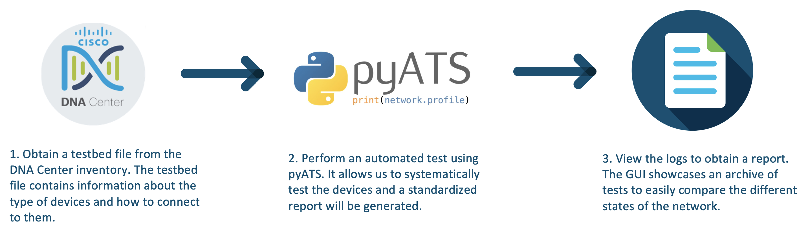
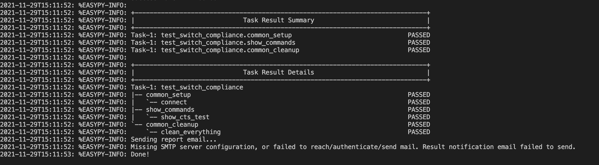
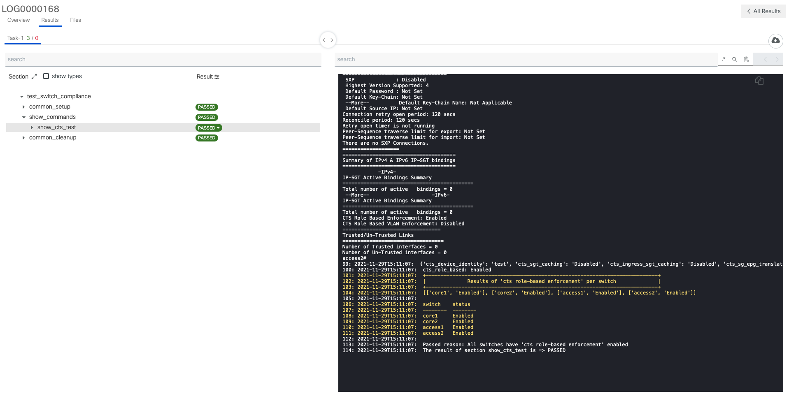

# GVE DevNet DNAC Switch Compliance pyATS

Cisco DNA Center (DNAC) is a network controller and management dashboard that allows the user to perform network operations. Moreover, a DNA Center in conjunction with ISE and a campus fabric allows us to enable Cisco Software-Defined Access (SDA). SDA automatically establishes and enforces security policies across the network. However, the automatic enforcement is only possible if `cts role-based enforcement` is enabled on the network devices. Policies and network configuration can be automatically pushed from DNA Center, but we also need to have an automated way of testing our changes. A good framework for automated testing is Cisco's pyATS. 


PyATS, which stands for Python Automated Test Systems was originally developed for internal Cisco engineering use, but it has been made available for the public. The solution is modular like lego blocks and consists of several layers. We will be making use of the following two modules:

* The original pyATS framework, which allows us to do the automated testing.
* The Genie Library famework, which is a standard open-source, platform/vendor agnostic library system. This framework contains the parsers, which allows us to convert the CLI output into JSON objects, so we can easily compare the output with each other.  

In this repository, we will share a script that can check the compliance of a switch using pyATS. Specifically, we are checking for each device whether `cts role-based enforcement` has been enabled, so SGTs can be enforced. 

> For more information about pyATS, go to my [blog](https://blogs.cisco.com/developer/automatetestingpyats01) or the [documentation](https://developer.cisco.com/docs/pyats/api/)



The PoV consists of three steps. In the first step, we have to obtain a testbed file from the DNA Center inventory. The testbed file contains information about the type of devices and how connect and interact with them. This file is a prerquisite in order for us to perform automated tests using pyATS. 

In the second step, we will actually perform the automated test using pyATS. After the test, a summary and report will be generated, see below. 



In the third step, we can also view the test report in the GUI. This interface also allows us to access previous reports, which enables us to easily compare different network states over time. 




## Contacts
* Simon Fang (sifang@cisco.com)

## Solution Components
* Python 3.8
* PyATS
* DNA Center

### Testbed
In order to use pyATS, we have to create a testbed file, which contains the information on how to connect to the devices. The testbed file will include include the following elements:

* IP address
* Port
* Credentials
* Protocol (SSH, Telnet)
* Type of device

An example testbed file has been provided in ```testbed_example.yaml```. If you want to read more on how to create a testbed file, then consult the documentation in the following link: 

> https://pubhub.devnetcloud.com/media/pyats-getting-started/docs/quickstart/manageconnections.html#creating-testbed-yaml-file


## Installation/Configuration
The following commands are executed in the terminal.

1. Create and activate a virtual environment for the project:
   
        #WINDOWS:
        $ py -3 -m venv [add_name_of_virtual_environment_here] 
        $ source [add_name_of_virtual_environment_here]/Scripts/activate
        #MAC:
        $ python3 -m venv [add_name_of_virtual_environment_here] 
        $ source [add_name_of_virtual_environment_here]/bin/activate
        

> For more information about virtual environments, please click [here](https://docs.python.org/3/tutorial/venv.html)

2. Access the created virutal environment folder

        $ cd [add_name_of_virtual_environment_here]

3. Clone this repository

        $ git clone [add_link_to_repository_here]

4. Access the folder `GVE_DevNet_DNAC_Switch_Compliance_pyATS`

        $ cd GVE_DevNet_DNAC_Switch_Compliance_pyATS

5. Install the dependencies:

        $ pip install -r requirements.txt


### Environment Variables
We have a separate file for the environment variables, e.g., DNA Center credentials and the name of the testbed file. Please update the `env_var` file with the credentials:

```python
dnac_username = "<insert_dnac_username>"
dnac_password = "<insert_dnac_password>"
dnac_url = "<insert_dnac_url>"
```

## Usage

The following commands need to be entered in your terminal

1. We create a testbed file from our DNAC inventory by using the following command

        $ python create_testbed_from_dnac_inventory.py <insert_name_of_testbed_file>


2. We perform an automated test in order to check switch compliance with the following command

        $ easypy test_scripts/test_switch_compliance_job.py -testbed_file <insert_name_of_testbed_file>

3. We check the logs and the test report with the following command

        $ pyats logs view

# Further Resources

- Sandboxes
  - [CML Sandbox](https://devnetsandbox.cisco.com/RM/Diagram/Index/45100600-b413-4471-b28e-b014eb824555?diagramType=Topology) (max 4 days - standard environment)
  - [CML Sandbox](https://devnetsandbox.cisco.com/RM/Diagram/Index/685f774a-a5d6-4df5-a324-3774217d0e6b?diagramType=Topology) (max 4 hours - optimized environment)
  - [DNA Center Always On 1.3.1.4](https://devnetsandbox.cisco.com/RM/Diagram/Index/471eb739-323e-4805-b2a6-d0ec813dc8fc?diagramType=Topology) (Read-Only)
  - [DNA Center Always On 2.2](https://devnetsandbox.cisco.com/RM/Diagram/Index/c3c949dc-30af-498b-9d77-4f1c07d835f9?diagramType=Topology) (Read-Only)
- pyATS
  - [Documentation](https://devnetsandbox.cisco.com/RM/Topology)
  - [Tutorial Series](https://xrdocs.io/programmability/tutorials/pyats-series-install-and-use-pyats/) (by Antoine Orsoni)
  - [Workshop](https://github.com/AntoineOrsoni/pyats-devnet-se-hour) (by Antoine Orsoni)
  - [Learning Lab: Introduction to pyATS](https://developer.cisco.com/learning/lab/intro-to-pyats/step/1)
- Genie
  - [Documentation](https://developer.cisco.com/docs/genie-docs/)
  - [Learning Lab: Genie PTS](https://developer.cisco.com/learning/lab/pts-with-genie/step/1)
  - [Parsers](https://pubhub.devnetcloud.com/media/genie-feature-browser/docs/#/parsers)
- Related repositories
  - [pyATS Config Diff Comparison](https://github.com/gve-sw/gve_devnet_pyats_config_diff_comparison)
  - [pyATS CML Simulated Test Environment](https://github.com/gve-sw/gve_devnet_pyats_cml_simulatedtestenvironment)
  - [pyATS Hostname App](https://github.com/gve-sw/gve_devnet_pyats_hostname_app)
- Cisco Code Exchange
  - [pyATS Lab Guide](https://developer.cisco.com/codeexchange/github/repo/sttrayno/pyATS-Lab-Guide)
  - [Intro Network Tests](https://developer.cisco.com/codeexchange/github/repo/hpreston/intro-network-tests)
  - [DNAC pyATS Genie](https://developer.cisco.com/codeexchange/github/repo/CiscoTestAutomation/DNAC-pyATS-Genie)
  - [Parse Genie](https://developer.cisco.com/codeexchange/github/repo/clay584/parse_genie)
- Blogs
  - [How to Automate Testing using Genie and pyATS](https://blogs.cisco.com/developer/automatetestingpyats01)
  - [The pyATS DevNet Journey: Aspirations & Inspirations](https://blogs.cisco.com/developer/363-pyatsjourney-01)
  - [pyATS & Genie - Network Enginers Transform!](https://blogs.cisco.com/developer/pyats-genie-transform)


### LICENSE

Provided under Cisco Sample Code License, for details see [LICENSE](LICENSE.md)

### CODE_OF_CONDUCT

Our code of conduct is available [here](CODE_OF_CONDUCT.md)

### CONTRIBUTING

See our contributing guidelines [here](CONTRIBUTING.md)

#### DISCLAIMER:
<b>Please note:</b> This script is meant for demo purposes only. All tools/ scripts in this repo are released for use "AS IS" without any warranties of any kind, including, but not limited to their installation, use, or performance. Any use of these scripts and tools is at your own risk. There is no guarantee that they have been through thorough testing in a comparable environment and we are not responsible for any damage or data loss incurred with their use.
You are responsible for reviewing and testing any scripts you run thoroughly before use in any non-testing environment.